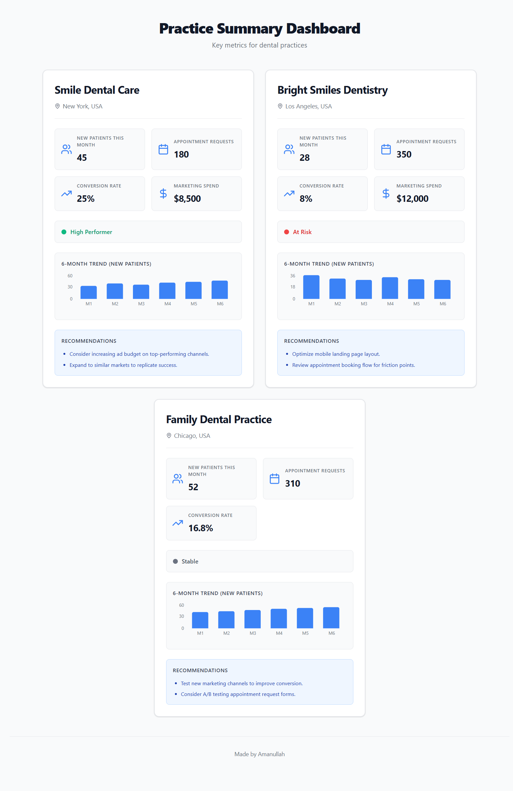
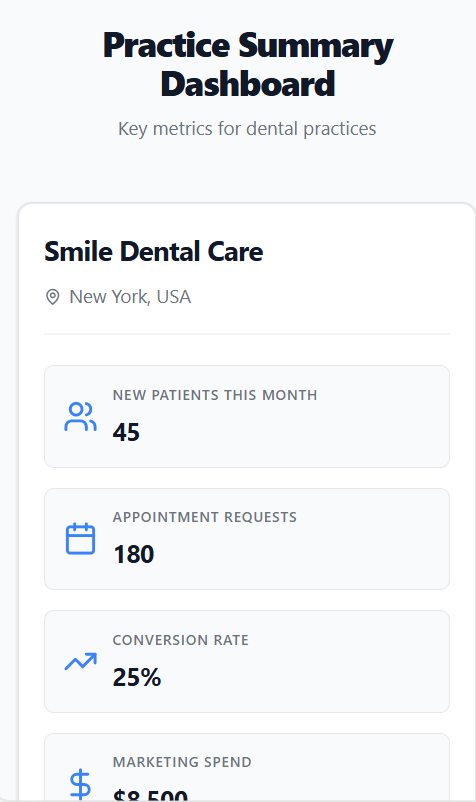

# Practice Summary Card - Technical Assessment

A React + TypeScript component for displaying dental practice metrics with a clean, professional design.

## Screenshots

### Desktop View


### Mobile View


## Quick Start

```bash
npm install
npm run dev
```

Visit `http://localhost:5173`

## Features

- Modular component architecture with 7 separate components
- Professional Lucide React icons
- Interactive Recharts visualizations
- Responsive design (desktop & mobile)
- TypeScript for type safety
- No gradients - clean, flat design

## Project Structure

```
src/
├── components/          # React components
│   ├── PracticeSummaryCard.tsx
│   ├── CardHeader.tsx
│   ├── MetricItem.tsx
│   ├── MetricsGrid.tsx
│   ├── StatusIndicator.tsx
│   ├── TrendChart.tsx
│   ├── Recommendations.tsx
│   └── Footer.tsx
├── styles/             # CSS files for each component
├── types/              # TypeScript type definitions
├── data/               # Mock data
└── App.tsx             # Main application
```

## Component Architecture

**Main Component:**
- `PracticeSummaryCard` - Composes all subcomponents

**Subcomponents:**
- `CardHeader` - Practice name and location
- `MetricsGrid` - 2x2 grid of key metrics
- `MetricItem` - Individual metric display (reusable)
- `StatusIndicator` - Performance status (High Performer/At Risk/Stable)
- `TrendChart` - 6-month trend visualization using Recharts
- `Recommendations` - Context-aware suggestions
- `Footer` - Attribution footer

## Data Model

```typescript
type PracticeSummary = {
  id: string;
  name: string;
  city: string;
  country: string;
  newPatientsThisMonth: number;
  appointmentRequests: number;
  conversionRate: number;
  monthlyTrend: number[];      // 6 months
  marketingSpend?: number;     // optional
};
```

## Key Design Decisions

### 1. Modular Architecture
- Small, focused components following single responsibility principle
- Each component has its own CSS file in the `styles/` folder
- Easy to test, maintain, and reuse

### 2. Status Logic
- **High Performer** (green): Conversion rate ≥ 20%
- **At Risk** (red): Conversion rate < 10%
- **Stable** (gray): Everything else

### 3. Dynamic Recommendations
Recommendations adapt based on practice performance:
- High performers: Growth strategies
- At-risk practices: Optimization tips
- Stable practices: Testing suggestions

### 4. Technology Choices
- **Lucide React**: Lightweight, professional icons
- **Recharts**: Simple, React-native chart library
- **Vanilla CSS**: Full control over styling
- **Vite**: Fast development and build

## Scaling Considerations

To integrate into a larger PracticeFuel dashboard:

1. **Add interactivity**: Click handlers for metrics, drill-down views
2. **State management**: Connect to Redux/Context for real data
3. **API integration**: Fetch practice data from backend
4. **Loading states**: Skeleton screens while data loads
5. **Error handling**: Graceful error states
6. **Accessibility**: ARIA labels, keyboard navigation
7. **Testing**: Unit tests with Vitest, component tests with React Testing Library

## Technologies

- React 18.2
- TypeScript 5.2
- Vite 5.0
- Lucide React (icons)
- Recharts (charts)

## Sample Data

The app displays 3 dental practices:

1. **Smile Dental Care** (New York) - High Performer (25% conversion)
2. **Bright Smiles Dentistry** (Los Angeles) - At Risk (8% conversion)
3. **Family Dental Practice** (Chicago) - Stable (16.8% conversion)

---


**Made by Amanullah**